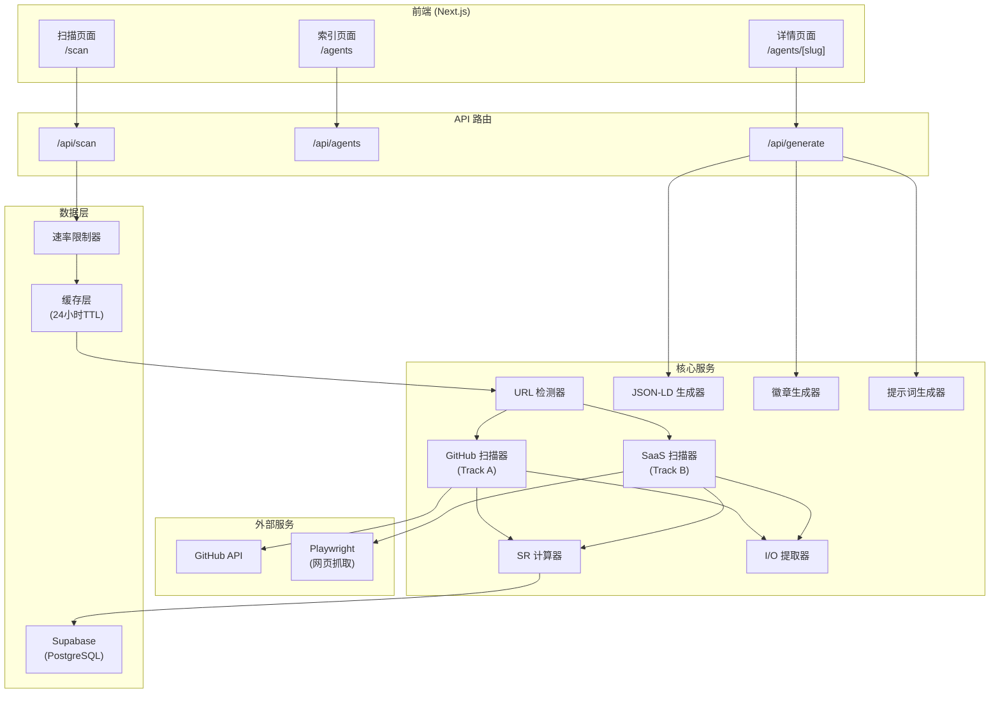

# 设计文档: Agent Scanner MVP

## 概述

Agent Scanner MVP 是一个 URL 驱动的 Agent 诊断和评分系统，核心目标是将传统的"填表式发布"转变为"诊断优化式发布"。系统通过双轨制评分引擎（Track A: GitHub, Track B: SaaS）计算 Signal Rank (SR) 评分，并提供 JSON-LD 生成、徽章嵌入、Interface Prompt 复制等功能，形成完整的 AEO (AI Engine Optimization) 闭环。

技术栈：Next.js 14 (App Router) + TypeScript + Supabase + Playwright + Tailwind CSS

## 架构设计



## 组件与接口

### 1. URL 检测器服务

```typescript
interface URLDetectorResult {
  type: 'github' | 'saas' | 'invalid';
  normalizedUrl: string;
  githubOwner?: string;
  githubRepo?: string;
}

interface IURLDetector {
  detect(url: string): Promise<URLDetectorResult>;
}
```

### 2. GitHub 扫描器 (Track A)

```typescript
interface GitHubScanResult {
  stars: number;
  forks: number;
  lastCommitDate: Date;
  hasLicense: boolean;
  hasOpenAPI: boolean;
  hasDockerfile: boolean;
  readmeLength: number;
  hasUsageCodeBlock: boolean;
  hasMCP: boolean;
  hasStandardInterface: boolean; // LangChain, Vercel AI SDK
  homepage?: string;
  description: string;
  topics: string[];
}

interface IGitHubScanner {
  scan(owner: string, repo: string): Promise<GitHubScanResult>;
}
```

### 3. SaaS 扫描器 (Track B)

```typescript
interface SaaSScanResult {
  httpsValid: boolean;
  sslValidMonths: number;
  socialLinks: string[];
  hasJsonLd: boolean;
  jsonLdContent?: object;
  hasBasicMeta: boolean;
  metaTitle?: string;
  metaDescription?: string;
  hasOgTags: boolean;
  ogImage?: string;
  hasApiDocsPath: boolean;
  apiDocsUrl?: string;
  hasIntegrationKeywords: boolean;
  integrationKeywords: string[];
  hasLoginButton: boolean;
  pageContent: string;
}

interface ISaaSScanner {
  scan(url: string): Promise<SaaSScanResult>;
}
```

### 4. SR 计算器

```typescript
interface SRScoreBreakdown {
  // Track A
  starsScore: number;        // 最高 2.0
  forksScore: number;        // 最高 1.0
  vitalityScore: number;     // 最高 2.0
  readinessScore: number;    // 最高 3.0
  protocolScore: number;     // 最高 2.0
  
  // Track B
  trustScore: number;        // 最高 3.0
  aeoScore: number;          // 最高 4.0
  interopScore: number;      // 最高 3.0
}

interface SRResult {
  finalScore: number;        // 0.0 - 10.0
  tier: 'S' | 'A' | 'B' | 'C';
  track: 'OpenSource' | 'SaaS' | 'Hybrid';
  scoreA: number;
  scoreB: number;
  breakdown: SRScoreBreakdown;
  isMCP: boolean;
  isVerified: boolean;
}

interface ISRCalculator {
  calculate(github?: GitHubScanResult, saas?: SaaSScanResult, isClaimed?: boolean): SRResult;
  getTier(score: number): 'S' | 'A' | 'B' | 'C';
}
```

### 5. I/O 提取器

```typescript
type IOModality = 'Text' | 'Image' | 'Audio' | 'JSON' | 'Code' | 'File' | 'Video' | 'Unknown';

interface IOResult {
  inputs: IOModality[];
  outputs: IOModality[];
}

interface IIOExtractor {
  extract(content: string): IOResult;
}
```

### 6. JSON-LD 生成器

```typescript
interface JSONLDOutput {
  jsonLd: object;
  jsonLdString: string;
  deploymentInstructions: string;
}

interface IJSONLDGenerator {
  generate(agent: AgentData): JSONLDOutput;
}
```

### 7. 徽章生成器

```typescript
interface BadgeOutput {
  svgUrl: string;
  embedCode: string;
  tier: 'S' | 'A' | 'B' | 'C';
  color: string;
}

interface IBadgeGenerator {
  generate(agentSlug: string, tier: 'S' | 'A' | 'B' | 'C', score: number): BadgeOutput;
}
```

### 8. 提示词生成器

```typescript
interface PromptOutput {
  systemPrompt: string;
  hasStructuredAPI: boolean;
  apiEndpoint?: string;
}

interface IPromptGenerator {
  generate(agent: AgentData): PromptOutput;
}
```

## 数据模型

### Agent 表 (Supabase)

```sql
CREATE TABLE agents (
  id UUID PRIMARY KEY DEFAULT gen_random_uuid(),
  slug VARCHAR(255) UNIQUE NOT NULL,
  name VARCHAR(255) NOT NULL,
  description TEXT,
  
  -- URLs
  github_url VARCHAR(500),
  homepage_url VARCHAR(500),
  api_docs_url VARCHAR(500),
  
  -- SR 评分
  sr_score DECIMAL(3,1) NOT NULL DEFAULT 0.0,
  sr_tier VARCHAR(1) NOT NULL DEFAULT 'C',
  sr_track VARCHAR(20) NOT NULL DEFAULT 'SaaS',
  score_github DECIMAL(3,1) DEFAULT 0.0,
  score_saas DECIMAL(3,1) DEFAULT 0.0,
  score_breakdown JSONB,
  
  -- 标志位
  is_mcp BOOLEAN DEFAULT FALSE,
  is_claimed BOOLEAN DEFAULT FALSE,
  is_verified BOOLEAN DEFAULT FALSE,
  
  -- I/O
  input_types TEXT[] DEFAULT '{}',
  output_types TEXT[] DEFAULT '{}',
  
  -- 元数据
  meta_title VARCHAR(255),
  meta_description TEXT,
  og_image VARCHAR(500),
  json_ld JSONB,
  
  -- GitHub 特定字段
  github_stars INTEGER DEFAULT 0,
  github_forks INTEGER DEFAULT 0,
  github_last_commit TIMESTAMP,
  
  -- 时间戳
  last_scanned_at TIMESTAMP DEFAULT NOW(),
  created_at TIMESTAMP DEFAULT NOW(),
  updated_at TIMESTAMP DEFAULT NOW()
);

CREATE INDEX idx_agents_sr_score ON agents(sr_score DESC);
CREATE INDEX idx_agents_is_verified ON agents(is_verified);
CREATE INDEX idx_agents_sr_tier ON agents(sr_tier);
CREATE INDEX idx_agents_slug ON agents(slug);
```

### 扫描历史表

```sql
CREATE TABLE scan_history (
  id UUID PRIMARY KEY DEFAULT gen_random_uuid(),
  agent_id UUID REFERENCES agents(id),
  sr_score DECIMAL(3,1) NOT NULL,
  score_breakdown JSONB,
  scanned_at TIMESTAMP DEFAULT NOW()
);

CREATE INDEX idx_scan_history_agent ON scan_history(agent_id, scanned_at DESC);
```

### 速率限制表

```sql
CREATE TABLE rate_limits (
  ip_address VARCHAR(45) PRIMARY KEY,
  scan_count INTEGER DEFAULT 0,
  window_start TIMESTAMP DEFAULT NOW()
);
```

### TypeScript 类型定义

```typescript
interface Agent {
  id: string;
  slug: string;
  name: string;
  description?: string;
  
  githubUrl?: string;
  homepageUrl?: string;
  apiDocsUrl?: string;
  
  srScore: number;
  srTier: 'S' | 'A' | 'B' | 'C';
  srTrack: 'OpenSource' | 'SaaS' | 'Hybrid';
  scoreGithub: number;
  scoreSaas: number;
  scoreBreakdown: SRScoreBreakdown;
  
  isMcp: boolean;
  isClaimed: boolean;
  isVerified: boolean;
  
  inputTypes: IOModality[];
  outputTypes: IOModality[];
  
  metaTitle?: string;
  metaDescription?: string;
  ogImage?: string;
  jsonLd?: object;
  
  githubStars?: number;
  githubForks?: number;
  githubLastCommit?: Date;
  
  lastScannedAt: Date;
  createdAt: Date;
  updatedAt: Date;
}

interface ScanRequest {
  url: string;
  forceRescan?: boolean;
}

interface ScanResponse {
  agent: Agent;
  isNew: boolean;
  isCached: boolean;
  cacheAge?: number; // 分钟
  diagnostics: DiagnosticItem[];
}

interface DiagnosticItem {
  metric: string;
  status: 'pass' | 'fail' | 'warning';
  score: number;
  maxScore: number;
  suggestion?: string;
}
```

## 正确性属性

*属性是指在系统所有有效执行中都应保持为真的特征或行为——本质上是关于系统应该做什么的形式化陈述。属性是人类可读规范与机器可验证正确性保证之间的桥梁。*

基于预分析，以下属性已被识别用于基于属性的测试。冗余属性已被合并。

### 属性 1: URL 验证正确性
*对于任意*字符串输入，URL 验证器应正确将其分类为有效（匹配 URL 模式）或无效，且有效 URL 应被一致地规范化。
**验证: 需求 1.1**

### 属性 2: URL 类型检测准确性
*对于任意*有效 URL，URL 检测器应正确将其分类为 'github'（如果匹配 github.com/owner/repo 模式）或 'saas'（所有其他有效 URL），不得有错误分类。
**验证: 需求 1.2, 1.3**

### 属性 3: 星标分数计算
*对于任意*非负整数星标数量，SR 计算器应根据阶梯系统返回正确的社区信任分数（>20k=2.0, >10k=1.5, >5k=1.0, >1k=0.5, 否则为 0）。
**验证: 需求 2.1**

### 属性 4: Fork 比率分数计算
*对于任意*非负整数的 forks 和 stars，SR 计算器应当且仅当 forks > stars * 0.1 时奖励 1.0 分。
**验证: 需求 2.2**

### 属性 5: 活跃度分数计算
*对于任意*表示最后提交的日期，SR 计算器应当且仅当该日期在当前日期 30 天内时奖励 1.0 分。
**验证: 需求 2.3**

### 属性 6: 文件检测评分
*对于任意*仓库中的文件名列表，SR 计算器应正确检测并评分 openapi.json、swagger.yaml、manifest.json（+1.5）和 Dockerfile（+0.5）的存在。
**验证: 需求 2.4, 2.6**

### 属性 7: MCP 关键词检测
*对于任意*文本内容（README、描述），SR 计算器应当且仅当内容包含 'mcp'、'model context protocol' 或 'mcp server'（不区分大小写）时检测到 MCP 支持。
**验证: 需求 2.5**

### 属性 8: README 质量评分
*对于任意* README 内容，SR 计算器应当且仅当内容超过 200 行且包含至少一个带有使用相关关键词的代码块时奖励 1.0 分。
**验证: 需求 2.7**

### 属性 9: I/O 模态提取
*对于任意*文本内容，I/O 提取器应基于关键词模式正确识别输入和输出模态，如果没有模式匹配则返回至少包含 'Unknown' 的非空结果。
**验证: 需求 2.8, 3.8**

### 属性 10: 社交链接检测
*对于任意* HTML 内容，SaaS 扫描器应正确计数和提取社交链接（Twitter、GitHub、Discord、LinkedIn），如果数量 >= 2 则奖励 1.0 分。
**验证: 需求 3.2**

### 属性 11: JSON-LD 检测
*对于任意* HTML 内容，SaaS 扫描器应当且仅当内容包含有效的 `<script type="application/ld+json">` 标签时检测到 JSON-LD 存在。
**验证: 需求 3.3**

### 属性 12: Meta 标签完整性
*对于任意* HTML 内容，SaaS 扫描器应当且仅当 title、meta description 和 H1 标签都存在且非空时奖励 1.0 分。
**验证: 需求 3.4**

### 属性 13: Open Graph 标签检测
*对于任意* HTML 内容，SaaS 扫描器应当且仅当 og:image 和 og:title meta 标签都存在时奖励 1.0 分。
**验证: 需求 3.5**

### 属性 14: API 文档路径检测
*对于任意*页面上的 URL/链接集合，SaaS 扫描器应在任何路径包含 '/docs'、'/api' 或 '/developers' 时检测到 API 文档。
**验证: 需求 3.6**

### 属性 15: 集成关键词检测
*对于任意*文本内容，SaaS 扫描器应在内容包含以下任一关键词时检测到集成能力：'sdk'、'webhook'、'zapier'、'plugin'（不区分大小写）。
**验证: 需求 3.7**

### 属性 16: 混合分数公式
*对于任意*两个分数（scoreA, scoreB），其中两者都是非负数，混合计算应返回 Max(scoreA, scoreB) + 0.5，封顶为 10.0。
**验证: 需求 4.1, 4.2, 4.3**

### 属性 17: 分数四舍五入
*对于任意*计算出的分数，最终分数应使用标准四舍五入规则精确到一位小数。
**验证: 需求 4.4**

### 属性 18: 等级分配
*对于任意*范围在 [0.0, 10.0] 的分数，等级分配应为：S 对应 [9.0-10.0]，A 对应 [7.5-8.9]，B 对应 [5.0-7.4]，C 对应 [0.0-5.0)。
**验证: 需求 4.5**

### 属性 19: 诊断建议
*对于任意*状态为 'fail' 的指标，结果展示应提供针对该指标的非空建议字符串。
**验证: 需求 5.4**

### 属性 20: JSON-LD 生成完整性
*对于任意* Agent 数据，生成的 JSON-LD 应是包含所有必需字段的有效 JSON：@type、name、description、url 和 provider。
**验证: 需求 6.1, 6.2, 6.3**

### 属性 21: 徽章颜色映射
*对于任意*等级（S、A、B、C），徽章生成器应返回正确的颜色：S 为绿色，A 为蓝色，B 为黄色，C 为灰色。
**验证: 需求 6.7**

### 属性 22: Agent 索引排序
*对于任意* Agent 列表，索引展示应按 SR 分数严格降序返回它们。
**验证: 需求 7.1**

### 属性 23: 已验证过滤器正确性
*对于任意*包含混合验证状态的 Agent 列表，应用"仅显示已验证"过滤器应只返回 isVerified === true 的 Agent。
**验证: 需求 7.4**

### 属性 24: Interface Prompt 生成
*对于任意* Agent 数据，提示词生成器应生成包含 Agent 名称和能力描述的非空提示词。
**验证: 需求 8.1, 8.2**

### 属性 25: API 密钥占位符
*对于任意*需要 API 密钥的 Agent，生成的提示词应包含确切的占位符文本"<PASTE_YOUR_KEY_HERE>"。
**验证: 需求 8.3**

### 属性 26: 自然语言回退
*对于任意*没有结构化 API 定义的 Track B Agent，提示词生成器应生成自然语言描述，而不是空的或错误的响应。
**验证: 需求 8.6**

### 属性 27: 数据持久化完整性
*对于任意*扫描结果，持久化的 Agent 记录应包含：sr_score、sr_track、score_breakdown 和 last_scanned_at 字段。
**验证: 需求 9.1, 9.2**

### 属性 28: 速率限制执行
*对于任意*在当前小时窗口内有 N 次扫描请求的 IP 地址，速率限制器应在 N < 5（匿名）或 N < 20（已认证）时允许请求，否则拒绝。
**验证: 需求 10.1, 10.6**

### 属性 29: 缓存命中逻辑
*对于任意*有现有扫描结果的 URL，如果扫描时间戳不到 24 小时，缓存层应返回缓存数据。
**验证: 需求 10.3, 10.4**

## 错误处理

### URL 验证错误
- 无效 URL 格式：返回 400，消息"无效的 URL 格式。请输入有效的 GitHub 仓库 URL 或网站 URL。"
- 无法访问的 URL：返回 502，消息"无法访问指定的 URL。请检查网站是否可访问。"

### GitHub API 错误
- 超过速率限制：实现指数退避（1s, 2s, 4s, 8s）最多重试 3 次，然后返回 503 带 retry-after 头
- 仓库未找到：返回 404，消息"GitHub 仓库未找到。请检查 URL。"
- 私有仓库：返回 403，消息"此仓库是私有的。只能扫描公开仓库。"

### 网页抓取错误
- Playwright 超时：最多重试 3 次，每次 5 秒超时，然后返回带警告的部分结果
- JavaScript 密集型网站：使用 Playwright 的 waitForLoadState('networkidle')，10 秒超时
- 被 robots.txt 阻止：跳过抓取，基于可用的 meta 标签返回部分结果

### 数据库错误
- 连接失败：返回 503，消息"服务暂时不可用。请重试。"
- 重复键：使用 upsert 逻辑优雅处理现有记录

### 速率限制错误
- 超过限制：返回 429，JSON 正文包含 `retryAfter`（秒）和用户友好的消息

## 测试策略

### 基于属性的测试框架
- **库**: fast-check (TypeScript)
- **最小迭代次数**: 每个属性 100 次
- **收缩**: 所有生成器启用

### 单元测试
单元测试将覆盖：
- URL 验证边界情况（空字符串、格式错误的 URL、特殊字符）
- 分数计算边界条件（恰好 1000 星、恰好 30 天前）
- JSON-LD schema 验证
- 徽章 SVG 生成

### 集成测试
- 使用模拟 GitHub API 响应的端到端扫描流程
- 缓存命中/未命中场景
- 多请求的速率限制行为

### 测试文件组织
```
lib/
├── sr-calculator.ts
├── sr-calculator.test.ts           # 单元测试
├── sr-calculator.property.test.ts  # 属性测试
├── url-detector.ts
├── url-detector.test.ts
├── io-extractor.ts
├── io-extractor.test.ts
├── json-ld-generator.ts
├── json-ld-generator.test.ts
├── badge-generator.ts
├── badge-generator.test.ts
├── prompt-generator.ts
├── prompt-generator.test.ts
└── rate-limiter.ts
    └── rate-limiter.test.ts
```

### 属性测试注释格式
每个基于属性的测试必须包含以下格式的注释：
```typescript
/**
 * **功能: agent-scanner-mvp, 属性 3: 星标分数计算**
 * 对于任意非负整数星标数量，SR 计算器应根据阶梯系统返回正确的社区信任分数。
 * **验证: 需求 2.1**
 */
```
