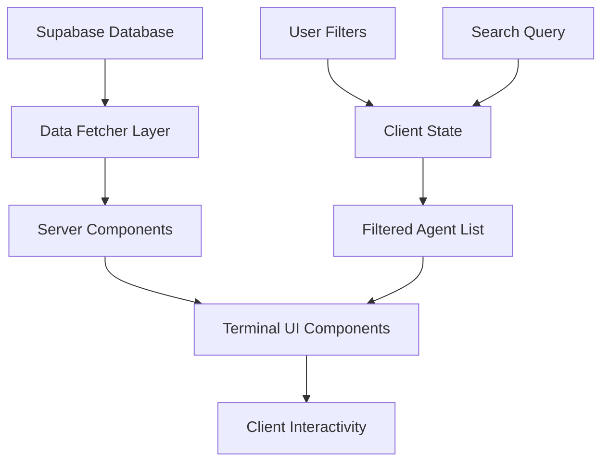

# Design Document: Agent Terminal UI

## Overview

本设计文档描述 Agent Signals 平台从 "App Store" 风格到 "Bloomberg Terminal" 风格的 UI 重构方案。新界面采用深色主题、高密度数据展示、终端美学，专为开发者和 AI 搜索引擎优化。

### 设计目标

1. **视觉转型**: 从明亮的渐变风格转为深色终端风格
2. **数据密度**: 在有限空间内展示更多有价值的信息
3. **专业感**: 营造 "Bloomberg Terminal for AI" 的专业氛围
4. **性能优先**: 保持现有的 ISR 缓存和代码分割优化

### 技术栈

- **Framework**: Next.js 14 (App Router) - 保持现有架构
- **Styling**: Tailwind CSS 3.4 - 扩展深色主题配置
- **Fonts**: JetBrains Mono (monospace) + Inter (sans-serif)
- **Icons**: Lucide React
- **Charts**: Recharts (雷达图)
- **Animations**: Tailwind CSS animations + CSS keyframes
- **Database**: Supabase PostgreSQL - 扩展 schema

## Architecture

### 组件层次结构

```
app/
├── layout.tsx                    # 根布局 (更新主题)
├── page.tsx                      # 首页 (Terminal Grid)
├── globals.css                   # 全局样式 (深色主题)
└── agents/
    └── [slug]/
        └── page.tsx              # Agent 详情页

components/
├── terminal/                     # 新增终端风格组件
│   ├── hero-terminal.tsx         # Hero Section
│   ├── omnibar.tsx               # 终端搜索栏
│   ├── signal-card.tsx           # Agent 卡片
│   ├── sidebar-filter.tsx        # 筛选面板
│   ├── agent-grid.tsx            # Agent 网格
│   ├── inspector-drawer.tsx      # 详情抽屉
│   ├── radar-chart.tsx           # 雷达图
│   ├── code-marquee.tsx          # 代码流动画
│   └── status-pill.tsx           # 状态指示器
├── publish/
│   └── publisher-form.tsx        # 发布表单 (分屏)
└── ui/
    └── ... (保留现有基础组件)
```

### 数据流



## Components and Interfaces

### 1. HeroTerminal Component

```typescript
interface HeroTerminalProps {
  signalCount: number
  onSearch: (query: string) => void
  searchValue: string
}
```

**职责**:
- 渲染深色背景 Hero 区域
- 显示主标题 "Index the Intelligence Economy."
- 渲染 Omnibar 搜索组件
- 显示状态指示器和信号计数
- 渲染代码流 Marquee 动画

### 2. SignalCard Component

```typescript
interface SignalCardProps {
  agent: {
    id: string
    slug: string
    name: string
    short_description: string
    entity_type: 'repo' | 'saas' | 'app'
    autonomy_level: 'L1' | 'L2' | 'L3' | 'L4' | 'L5'
    status: 'online' | 'offline' | 'maintenance'
    metrics: {
      latency?: number
      uptime?: number
      stars?: number
      forks?: number
      cost?: number
    }
    framework?: string
    tags: string[]
    rank: number
  }
  onClick?: () => void
}
```

**职责**:
- 渲染紧凑的 Agent 信息卡片
- 显示状态指示器 (在线/离线)
- 显示框架图标和自主等级徽章
- 显示关键指标 (延迟、成本、技术栈)
- 处理悬停动画效果
- Top 3 排名显示紫色光晕

### 3. SidebarFilter Component

```typescript
interface FilterState {
  search: string
  maxLatency: number
  minSuccessRate: number
  frameworks: string[]
  entityTypes: ('repo' | 'saas' | 'app')[]
  autonomyLevels: string[]
}

interface SidebarFilterProps {
  filters: FilterState
  onFiltersChange: (filters: FilterState) => void
  availableFrameworks: string[]
}
```

**职责**:
- 渲染框架复选框过滤器
- 渲染延迟和成功率滑块
- 渲染实体类型过滤器
- 显示实时连接状态
- 响应式隐藏 (移动端)

### 4. AgentGrid Component

```typescript
interface AgentGridProps {
  agents: SignalCardProps['agent'][]
  isLoading: boolean
  onAgentClick: (agent: SignalCardProps['agent']) => void
}
```

**职责**:
- 响应式网格布局 (1/2/3/4 列)
- 显示搜索结果计数
- 空状态处理
- 加载骨架屏

### 5. InspectorDrawer Component

```typescript
interface InspectorDrawerProps {
  agent: SignalCardProps['agent'] | null
  isOpen: boolean
  onClose: () => void
}
```

**职责**:
- 从右侧滑入的抽屉组件
- 显示雷达图 (5 维度)
- 显示 API 代码片段
- 显示操作按钮

### 6. PublisherForm Component

```typescript
interface PublisherFormProps {
  onSubmit: (data: AgentSubmission) => Promise<void>
}

interface AgentSubmission {
  url: string
  name: string
  description: string
  category: string
  entityType: 'repo' | 'saas' | 'app'
  autonomyLevel: string
}
```

**职责**:
- 分屏布局 (表单 + JSON-LD 预览)
- 实时 URL 验证
- 实时 JSON-LD 生成
- 表单提交处理

## Data Models

### Extended Agent Schema

```sql
-- 扩展 agents 表
ALTER TABLE agents ADD COLUMN IF NOT EXISTS entity_type VARCHAR(10) DEFAULT 'saas';
ALTER TABLE agents ADD COLUMN IF NOT EXISTS autonomy_level VARCHAR(5) DEFAULT 'L2';
ALTER TABLE agents ADD COLUMN IF NOT EXISTS metrics JSONB DEFAULT '{}';
ALTER TABLE agents ADD COLUMN IF NOT EXISTS status VARCHAR(20) DEFAULT 'online';
ALTER TABLE agents ADD COLUMN IF NOT EXISTS rank INTEGER DEFAULT 999;
ALTER TABLE agents ADD COLUMN IF NOT EXISTS framework VARCHAR(50);
ALTER TABLE agents ADD COLUMN IF NOT EXISTS geo_score INTEGER DEFAULT 50;

-- 添加约束
ALTER TABLE agents ADD CONSTRAINT check_entity_type 
  CHECK (entity_type IN ('repo', 'saas', 'app'));
ALTER TABLE agents ADD CONSTRAINT check_autonomy_level 
  CHECK (autonomy_level IN ('L1', 'L2', 'L3', 'L4', 'L5'));
ALTER TABLE agents ADD CONSTRAINT check_status 
  CHECK (status IN ('online', 'offline', 'maintenance'));
```

### TypeScript Types

```typescript
// lib/types/agent.ts
export interface AgentMetrics {
  latency?: number      // ms, for saas
  uptime?: number       // percentage, for saas
  stars?: number        // for repo
  forks?: number        // for repo
  cost?: number         // $ per request
  lastCommit?: string   // ISO date, for repo
  lastPing?: string     // relative time
}

export type EntityType = 'repo' | 'saas' | 'app'
export type AutonomyLevel = 'L1' | 'L2' | 'L3' | 'L4' | 'L5'
export type AgentStatus = 'online' | 'offline' | 'maintenance'

export interface ExtendedAgent {
  id: string
  slug: string
  name: string
  short_description: string
  detailed_description: string | null
  entity_type: EntityType
  autonomy_level: AutonomyLevel
  status: AgentStatus
  metrics: AgentMetrics
  framework: string | null
  tags: string[]
  rank: number
  geo_score: number
  official_url: string | null
  created_at: string
  updated_at: string
}
```

### GEO Score Calculation

```typescript
// lib/geo-score.ts
export function calculateGeoScore(agent: ExtendedAgent): number {
  let score = 50 // Base

  // Vitality (20 points)
  if (agent.entity_type === 'saas' && agent.metrics.uptime) {
    score += Math.min(20, agent.metrics.uptime / 5)
  } else if (agent.entity_type === 'repo' && agent.metrics.lastCommit) {
    const daysSinceCommit = getDaysSince(agent.metrics.lastCommit)
    score += Math.max(0, 20 - daysSinceCommit)
  }

  // Influence (10 points)
  if (agent.metrics.stars) {
    score += Math.min(10, Math.log10(agent.metrics.stars) * 2)
  }

  // Metadata completeness (10 points)
  const metadataScore = [
    agent.detailed_description,
    agent.tags.length > 0,
    agent.official_url,
    agent.framework
  ].filter(Boolean).length * 2.5
  score += metadataScore

  // Autonomy bonus (0-10 points)
  const autonomyBonus: Record<AutonomyLevel, number> = {
    L1: 0, L2: 2, L3: 5, L4: 8, L5: 10
  }
  score += autonomyBonus[agent.autonomy_level]

  return Math.min(100, Math.round(score))
}
```


## Correctness Properties

*A property is a characteristic or behavior that should hold true across all valid executions of a system-essentially, a formal statement about what the system should do. Properties serve as the bridge between human-readable specifications and machine-verifiable correctness guarantees.*

Based on the acceptance criteria analysis, the following correctness properties have been identified:

### Property 1: Signal Card Complete Rendering

*For any* valid agent object with all required fields (name, status, rank, entity_type, autonomy_level, metrics, tags), the SignalCard component should render all these fields in the output HTML.

**Validates: Requirements 3.1, 3.2, 3.3, 3.4**

### Property 2: Top Tier Styling

*For any* agent with rank <= 3, the SignalCard component should apply the top-tier styling class (purple glow effect).

**Validates: Requirements 3.5**

### Property 3: Offline Status Display

*For any* agent with status === 'offline', the SignalCard component should display "Offline" text and apply muted styling classes.

**Validates: Requirements 3.7**

### Property 4: Search Filter Correctness

*For any* search query string and list of agents, the filtered result should only contain agents where the name, description, or tags contain the search query (case-insensitive).

**Validates: Requirements 2.5**

### Property 5: Framework Filter Correctness

*For any* set of selected frameworks and list of agents, the filtered result should only contain agents whose framework is in the selected set (or all agents if no frameworks selected).

**Validates: Requirements 4.5**

### Property 6: Grid Header Accuracy

*For any* search query and filtered agent list, the grid header should display the exact search query string and the exact count of filtered agents.

**Validates: Requirements 5.2**

### Property 7: Agent Data Validation

*For any* agent object, the entity_type must be one of ['repo', 'saas', 'app'], the autonomy_level must be one of ['L1', 'L2', 'L3', 'L4', 'L5'], and the metrics field must be a valid object.

**Validates: Requirements 6.1, 6.2, 6.3**

### Property 8: GEO Score Calculation

*For any* valid agent object, the calculated GEO score should be between 0 and 100 (inclusive), and should equal: Base(50) + Vitality(0-20) + Influence(0-10) + Metadata(0-10) + Autonomy(0-10).

**Validates: Requirements 6.4**

### Property 9: Entity Type Icon Mapping

*For any* entity_type value, the getEntityIcon function should return: '📦' for 'repo', '🌐' for 'saas', '📱' for 'app'.

**Validates: Requirements 6.5**

### Property 10: API Snippet Generation

*For any* agent with a valid official_url, the generateApiSnippet function should produce a non-empty code string containing the agent's URL.

**Validates: Requirements 7.3**

### Property 11: URL Validation

*For any* string input, the validateUrl function should return true only for strings that are valid HTTP/HTTPS URLs with proper format.

**Validates: Requirements 8.2**

### Property 12: JSON-LD Preview Generation

*For any* valid form data object, the generateJsonLd function should produce valid JSON-LD that contains all input field values and can be parsed back to extract the original values (round-trip).

**Validates: Requirements 8.3**

### Property 13: Form Validation Completeness

*For any* form submission, if any required field is empty or invalid, the validation function should return an error object with messages for all invalid fields.

**Validates: Requirements 8.4, 8.5**

### Property 14: Status Pill Signal Count

*For any* non-negative integer signal count, the StatusPill component should render the exact count value in the output.

**Validates: Requirements 2.2**

## Error Handling

### Component Error Boundaries

```typescript
// components/terminal/error-boundary.tsx
'use client'

import { Component, ReactNode } from 'react'

interface Props {
  children: ReactNode
  fallback?: ReactNode
}

interface State {
  hasError: boolean
}

export class TerminalErrorBoundary extends Component<Props, State> {
  state = { hasError: false }

  static getDerivedStateFromError() {
    return { hasError: true }
  }

  render() {
    if (this.state.hasError) {
      return this.props.fallback || (
        <div className="bg-zinc-900 border border-red-900/50 rounded p-4 text-red-400 font-mono text-sm">
          <span className="text-red-500">ERROR:</span> Component failed to render
        </div>
      )
    }
    return this.props.children
  }
}
```

### Data Fetching Errors

```typescript
// lib/data-fetcher.ts (扩展)
export async function getAgentsWithFallback(): Promise<ExtendedAgent[]> {
  try {
    const { data, error } = await supabaseAdmin
      .from('agents')
      .select('*')
      .order('geo_score', { ascending: false })
    
    if (error) throw error
    return data || []
  } catch (error) {
    console.error('Failed to fetch agents:', error)
    return [] // 返回空数组而非抛出错误
  }
}
```

### Filter State Validation

```typescript
// lib/filter-utils.ts
export function sanitizeFilterState(filters: Partial<FilterState>): FilterState {
  return {
    search: typeof filters.search === 'string' ? filters.search : '',
    maxLatency: Math.min(2000, Math.max(0, filters.maxLatency || 2000)),
    minSuccessRate: Math.min(100, Math.max(0, filters.minSuccessRate || 0)),
    frameworks: Array.isArray(filters.frameworks) ? filters.frameworks : [],
    entityTypes: Array.isArray(filters.entityTypes) ? filters.entityTypes : [],
    autonomyLevels: Array.isArray(filters.autonomyLevels) ? filters.autonomyLevels : []
  }
}
```

## Testing Strategy

### Dual Testing Approach

本项目采用单元测试和属性测试相结合的策略：

- **单元测试**: 验证特定示例和边界情况
- **属性测试**: 验证在所有有效输入上都应成立的通用属性

### Property-Based Testing Library

使用 **fast-check** 作为属性测试库，配合 Vitest 测试框架。

```bash
npm install --save-dev fast-check
```

### Test File Structure

```
test/
├── terminal/
│   ├── signal-card.test.tsx      # SignalCard 单元测试
│   ├── signal-card.property.ts   # SignalCard 属性测试
│   ├── filter.test.ts            # 过滤逻辑单元测试
│   ├── filter.property.ts        # 过滤逻辑属性测试
│   ├── geo-score.test.ts         # GEO Score 单元测试
│   ├── geo-score.property.ts     # GEO Score 属性测试
│   └── json-ld.property.ts       # JSON-LD 生成属性测试
└── setup.ts
```

### Property Test Configuration

每个属性测试应运行至少 100 次迭代：

```typescript
// vitest.config.ts
export default defineConfig({
  test: {
    // ... existing config
  }
})

// 在属性测试中
fc.assert(
  fc.property(/* ... */),
  { numRuns: 100 }
)
```

### Test Annotation Format

每个属性测试必须使用以下格式标注：

```typescript
/**
 * **Feature: agent-terminal-ui, Property 4: Search Filter Correctness**
 * **Validates: Requirements 2.5**
 */
test('search filter returns only matching agents', () => {
  fc.assert(/* ... */)
})
```

### Generator Examples

```typescript
// test/generators/agent.ts
import * as fc from 'fast-check'

export const entityTypeArb = fc.constantFrom('repo', 'saas', 'app')
export const autonomyLevelArb = fc.constantFrom('L1', 'L2', 'L3', 'L4', 'L5')
export const statusArb = fc.constantFrom('online', 'offline', 'maintenance')

export const metricsArb = fc.record({
  latency: fc.option(fc.integer({ min: 0, max: 5000 })),
  uptime: fc.option(fc.float({ min: 0, max: 100 })),
  stars: fc.option(fc.integer({ min: 0, max: 100000 })),
  forks: fc.option(fc.integer({ min: 0, max: 10000 })),
  cost: fc.option(fc.float({ min: 0, max: 1 }))
})

export const agentArb = fc.record({
  id: fc.uuid(),
  slug: fc.string({ minLength: 1, maxLength: 50 }),
  name: fc.string({ minLength: 1, maxLength: 100 }),
  short_description: fc.string({ minLength: 0, maxLength: 500 }),
  entity_type: entityTypeArb,
  autonomy_level: autonomyLevelArb,
  status: statusArb,
  metrics: metricsArb,
  framework: fc.option(fc.constantFrom('LangChain', 'AutoGPT', 'BabyAGI', 'LlamaIndex', 'Custom')),
  tags: fc.array(fc.string({ minLength: 1, maxLength: 20 }), { maxLength: 5 }),
  rank: fc.integer({ min: 1, max: 1000 }),
  geo_score: fc.integer({ min: 0, max: 100 })
})
```

