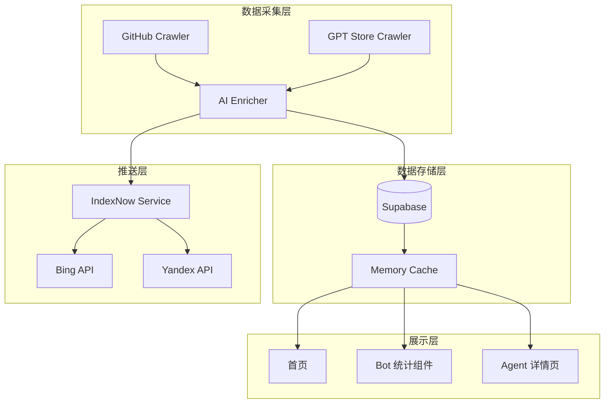

# Design Document: GEO Enhancement V2 - Phase 1

## Overview

本设计文档描述 GEO 增强 V2 第一阶段的三个核心功能实现方案：
1. **GitHub 爬虫** - 从 GitHub 抓取 AI Agent 项目，快速扩充数据到 1000+
2. **首页 AI Bot 统计展示** - 在首页展示各 AI Bot 的访问统计和趋势
3. **IndexNow 主动推送** - 内容更新时主动通知搜索引擎加速索引

## Architecture



## Components and Interfaces

### 1. GitHub Crawler (`crawler/sources/github.ts`)

```typescript
interface GitHubRepo {
  id: number
  name: string
  full_name: string
  description: string | null
  html_url: string
  stargazers_count: number
  topics: string[]
  readme_content?: string
  owner: {
    login: string
    avatar_url: string
  }
  created_at: string
  updated_at: string
}

interface CrawlResult {
  success: boolean
  total: number
  created: number
  updated: number
  failed: number
  errors: Array<{ repo: string; error: string }>
}

// 主要接口
async function crawlGitHub(options: {
  topic?: string
  minStars?: number
  maxResults?: number
}): Promise<CrawlResult>

async function fetchRepoReadme(owner: string, repo: string): Promise<string | null>

async function processGitHubRepo(repo: GitHubRepo): Promise<RawAgentData>
```

### 2. AI Bot Stats Component (`components/ai-bot-homepage-stats.tsx`)

```typescript
interface BotVisitStats {
  bot_name: string
  total_visits: number
  visits_7d: number
  visits_prev_7d: number
  growth_rate: number  // 周环比增长率
  trend: 'up' | 'down' | 'stable'
}

interface HomepageBotStatsProps {
  stats: BotVisitStats[]
  loading?: boolean
}

// 服务端数据获取
async function getHomepageBotStats(): Promise<BotVisitStats[]>
```

### 3. IndexNow Service (`lib/indexnow.ts`)

```typescript
interface IndexNowConfig {
  key: string
  keyLocation: string
  host: string
}

interface IndexNowResult {
  success: boolean
  url: string
  error?: string
}

// 主要接口
async function notifyIndexNow(urls: string[]): Promise<IndexNowResult[]>

async function notifyAgentPublished(agentSlug: string): Promise<void>

async function notifyAgentUpdated(agentSlug: string): Promise<void>

async function batchNotify(urls: string[], batchSize?: number): Promise<void>
```

## Data Models

### GitHub 数据源扩展

```sql
-- 扩展 agents 表，增加 GitHub 相关字段
ALTER TABLE agents ADD COLUMN IF NOT EXISTS github_stars INTEGER DEFAULT 0;
ALTER TABLE agents ADD COLUMN IF NOT EXISTS github_url TEXT;
ALTER TABLE agents ADD COLUMN IF NOT EXISTS github_owner TEXT;
ALTER TABLE agents ADD COLUMN IF NOT EXISTS github_topics TEXT[];

-- 创建索引
CREATE INDEX IF NOT EXISTS idx_agents_github_stars ON agents(github_stars DESC);
CREATE INDEX IF NOT EXISTS idx_agents_source ON agents(source);
```

### Bot 访问统计视图

```sql
-- 创建 7 天统计视图
CREATE OR REPLACE VIEW bot_stats_7d AS
SELECT 
  ai_name as bot_name,
  COUNT(*) as total_visits,
  COUNT(*) FILTER (WHERE visited_at > NOW() - INTERVAL '7 days') as visits_7d,
  COUNT(*) FILTER (WHERE visited_at > NOW() - INTERVAL '14 days' 
                   AND visited_at <= NOW() - INTERVAL '7 days') as visits_prev_7d
FROM ai_visits
GROUP BY ai_name;
```

## Correctness Properties

*A property is a characteristic or behavior that should hold true across all valid executions of a system-essentially, a formal statement about what the system should do. Properties serve as the bridge between human-readable specifications and machine-verifiable correctness guarantees.*

### Property 1: GitHub API 请求参数正确性
*For any* crawl execution with topic filter, the GitHub API request SHALL include the correct query parameters (`q=topic:{topic}`, `sort=stars`, `order=desc`)
**Validates: Requirements 1.1**

### Property 2: 结构化数据 Schema 一致性
*For any* GitHub repo processed by the enricher, the output SHALL conform to the RawAgentData schema with all required fields populated
**Validates: Requirements 1.2**

### Property 3: 更新幂等性
*For any* existing agent in the database, running the crawler with the same GitHub repo SHALL update `github_stars` and `last_crawled_at` without creating duplicate records
**Validates: Requirements 1.3**

### Property 4: 爬取报告完整性
*For any* completed crawl operation, the CrawlResult SHALL contain `created + updated + failed = total`
**Validates: Requirements 1.5**

### Property 5: Bot 统计数据正确性
*For any* set of ai_visits records, the calculated `visits_7d` SHALL equal the count of visits where `visited_at > NOW() - 7 days`
**Validates: Requirements 2.1**

### Property 6: 增长率计算正确性
*For any* bot with visits_7d and visits_prev_7d, the growth_rate SHALL equal `(visits_7d - visits_prev_7d) / visits_prev_7d * 100` (or 0 if visits_prev_7d is 0)
**Validates: Requirements 2.3**

### Property 7: IndexNow 调用触发
*For any* newly published agent, the IndexNow service SHALL be called with the agent's canonical URL
**Validates: Requirements 4.1**

### Property 8: IndexNow 错误隔离
*For any* IndexNow API failure, the main agent publish/update operation SHALL complete successfully
**Validates: Requirements 4.3**

### Property 9: 批量请求合并
*For any* batch of N URLs to notify, the number of IndexNow API calls SHALL be `ceil(N / batchSize)` where batchSize defaults to 10000
**Validates: Requirements 4.4**

## Error Handling

### GitHub Crawler
- **API Rate Limit**: 检测 403 响应，等待 `X-RateLimit-Reset` 时间后重试
- **Network Error**: 指数退避重试，最多 3 次
- **Invalid Repo**: 跳过并记录，不中断整体流程
- **AI Analysis Failure**: 使用基础数据入库，标记需要重新分析

### IndexNow Service
- **API Failure**: 记录错误日志，不阻塞主流程
- **Invalid URL**: 过滤无效 URL，只发送有效的
- **Rate Limit**: 使用队列延迟发送

### Bot Stats Component
- **Data Loading Error**: 显示友好错误提示，提供重试按钮
- **Empty Data**: 显示"暂无数据"状态

## Testing Strategy

### 测试框架
- **单元测试**: Vitest
- **属性测试**: fast-check (Property-Based Testing)
- **集成测试**: Vitest + MSW (Mock Service Worker)

### 单元测试覆盖
1. GitHub API 响应解析
2. 增长率计算函数
3. URL 批量合并逻辑
4. 数据转换函数

### 属性测试覆盖
每个 Correctness Property 对应一个属性测试：
- Property 1-4: GitHub Crawler 相关
- Property 5-6: Bot Stats 相关
- Property 7-9: IndexNow 相关

### 属性测试配置
```typescript
// 每个属性测试运行 100 次迭代
fc.assert(
  fc.property(/* generators */, /* property */),
  { numRuns: 100 }
)
```

### 测试标注格式
```typescript
/**
 * **Feature: geo-enhancement-v2, Property 1: GitHub API 请求参数正确性**
 * **Validates: Requirements 1.1**
 */
test.prop([/* generators */])('GitHub API request includes correct parameters', /* ... */)
```
